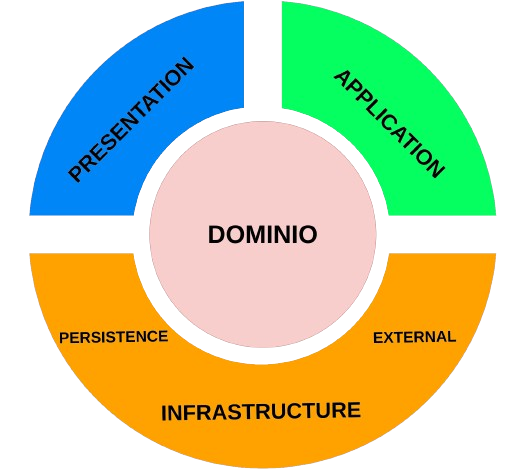

Description

[Nest](https://github.com/nestjs/nest) framework TypeScript starter repository.

Proyecto basado en DDD(Codigo limpio)



## Arbol del modelo

.
├── Dockerfile
├── estructura_de_carpetas.txt
├── jest.config.js
├── nest-cli.json
├── package.json
├── README.md
├── src
│   ├── application
│   │   ├── mapper
│   │   │   ├── ... (mapper files)
│   │   └── useCases
│   │       ├── dependencies.ts
│   │       └── ... (useCases folders and files)
│   ├── config
│   │   ├── db
│   │   └── DependencyInjection
│   │       ├── application.module.ts
│   │       ├── app.module.ts
│   │       ├── infrastructure.module.ts
│   │       ├── package.module.ts
│   │       └── presentation.module.ts
│   ├── domain
│   │   ├── entities.ts
│   │   ├── ... (domain folders and files)
│   │   └── interfaces
│   │       ├── application
│   │       │   ├── ... (application interfaces)
│   │       ├── infrastructure
│   │       │   └── ... (infrastructure interfaces)
│   │       └── package
│   │           └── ... (package interfaces)
│   ├── infrastructure
│   │   ├── context
│   │   │   ├── genericRepository.ts
│   │   │   └── index.ts
│   │   ├── dependencies.ts
│   │   └── repository
│   ├── package
│   │   └── dependencies.ts
│   └── presentation
│       ├── controllers
│       │   ├── controllers.module.ts
│       └── main.ts
├── __test__
│   ├── application
│   │   ├── ... (application test files)
│   ├── infrastructure
│   │   ├── ... (infrastructure test files)
│   ├── package
│   │   └── ... (package test files)
│   ├── jest-e2e.json
│   └── mocks
├── tsconfig.build.json
├── tsconfig.json
└── yarn.lock

## Installation

```bash
$ yarn install
```

## Running the app

```bash
# development
$ yarn run start

# watch mode
$ yarn run start:dev

# production mode
$ yarn run start:prod
```

## Test

```bash
# unit tests
$ yarn run test

# e2e tests
$ yarn run test:e2e

# test coverage
$ yarn run test:cov
```
